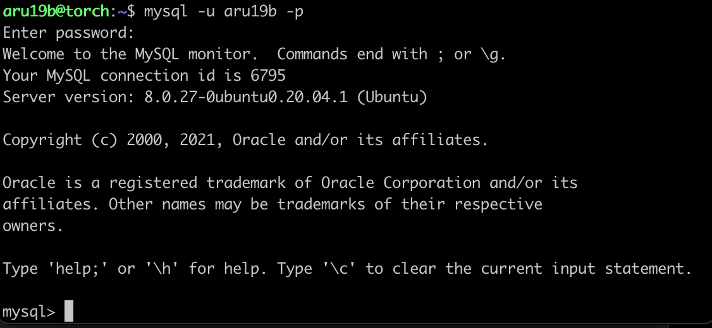
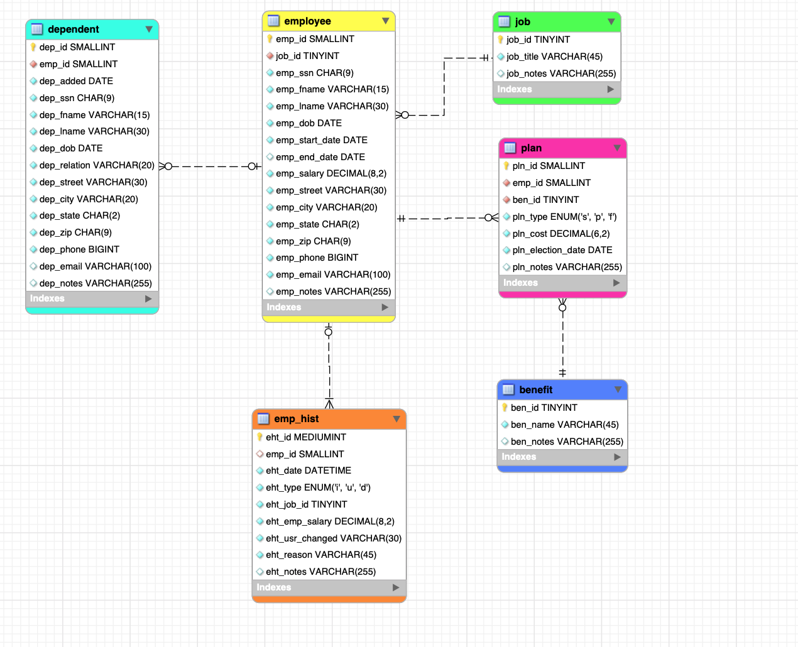
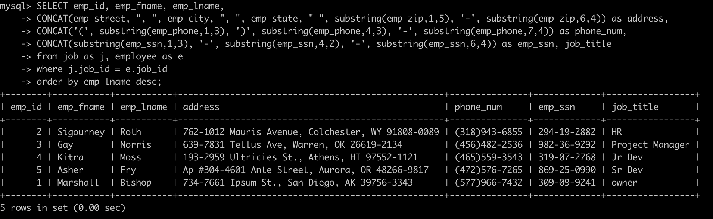

> **NOTE:** This README.md file should be placed at the **root of each of your repos directories.**
>
>Also, this file **must** use Markdown syntax, and provide project documentation as per below--otherwise, points **will** be deducted.
>

# lis3781 Advanced Database Management

## Ashton Uttayaya

### Assignment 1 Requirements:

*Five Parts:*

1. Distributed Version Control with Git and Bitbucket
2. AMPPS Installation
3. Questions
4. Entity Relationship Diagram, and SQL Code
5. Bitbucket Repo link:
 <ol>a.) This Assignment [Assignment 1](https://bitbucket.org/aru19b/lis3781/src/master/a1/)</ol>
 <ol>b.) The Completed Tutorial (bitbucketstationlocations)[My Bitbucketstationlocations](https://bitbucket.org/aru19b/bitbucketstationlocations/ "Bitbucket Station Locations")</ol>

> #### A1 Business Rules: 
> The human resource (HR) department of the ACME company wants to contract a database modeler/designer to collect the following employee data for tax purposes: job description, length of employment, benefits, number of dependents and their relationships, DOB of both the employee and any respective dependents. In addition, employees’ histories must be tracked. Also, include the following business rules:
>
> • Each employee may have one or more dependents. 
>
> • Each employee has only one job.
>
> • Each job can be held by many employees.
> 
> • Many employees may receive many benefits.
> 
> • Many benefits may be selected by many employees (though, while they may not select any benefits— any dependents of employees may be on an employee’s plan).
Notes:
> 
> • Employee/Dependent tables must use suitable attributes (See Assignment Guidelines);
>
> In Addition:
> 
> • Employee: SSN, DOB, start/end dates, salary;
> 
> • Dependent: same information as their associated employee (though, not start/end dates), date added (as dependent), type of relationship: e.g., father, mother, etc.
> 
> • Job: title (e.g., secretary, service tech., manager, cashier, janitor, IT, etc.)
> 
> • Benefit: name (e.g., medical, dental, long-term disability, 401k, term life insurance, etc.)
> 
> • Plan: type (single, spouse, family), cost, election date (plans must be unique)
>
> • Employee history: jobs, salaries, and benefit changes, as well as who made the change and why;
> 
> • Zero Filled data: SSN, zip codes (not phone numbers: US area codes not below 201, NJ);
> 
> • *All* tables must include notes attribute.

#### README.md file should include the following items:

* Screenshot of A1 ERD
* Ex. 1 SQL Solution
* Git Commands with short description
 
> #### Git commands w/short descriptions:

1. git init - Creates empty git repo in specified directory, runs with no arguments to initialize current directory as git repo
2. git status - list all staged, unstaged, and untracked files
3. git add - stages specified changes for next commit
4. git commit - commits version being pushed with specified message
5. git push - pushes local branches to remote repository
6. git pull - pulls all changes made on remote repository to local repository
7. git diff - shows unstaged changes between local and remote repository

#### Assignment Screenshots:

#### *Screenshot of AMPPS running*:

#### *Screenshot of A1 ERD*:

#### *Screenshot of A1 Ex 1*:

#### Tutorial Links:

*Bitbucket Tutorial - Station Locations:*
[A1 Bitbucket Station Locations Tutorial Link](https://bitbucket.org/aru19b/bitbucketstationlocations/ "Bitbucket Station Locations")
