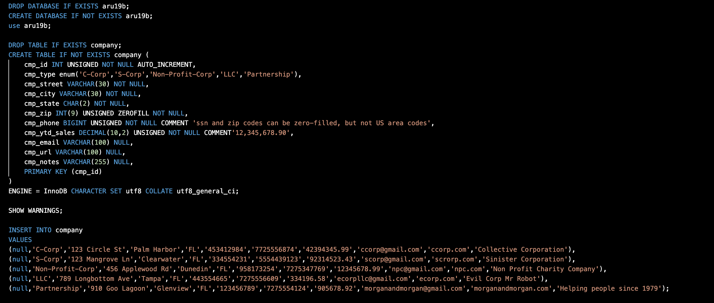
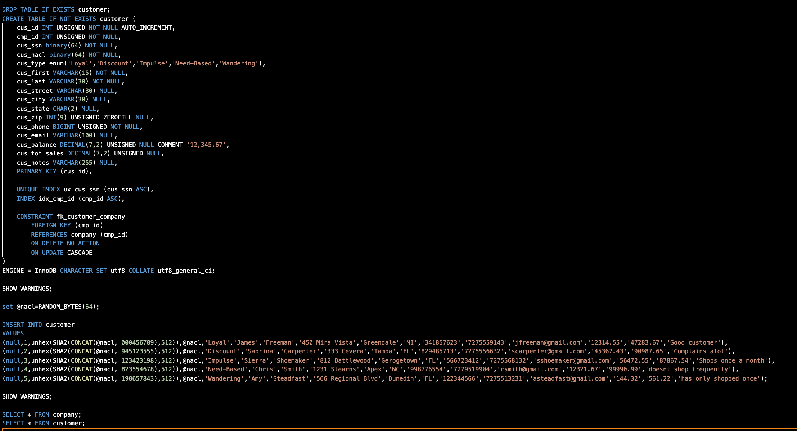
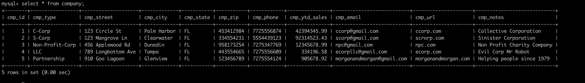
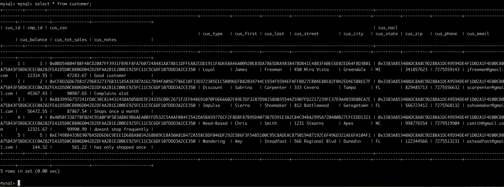
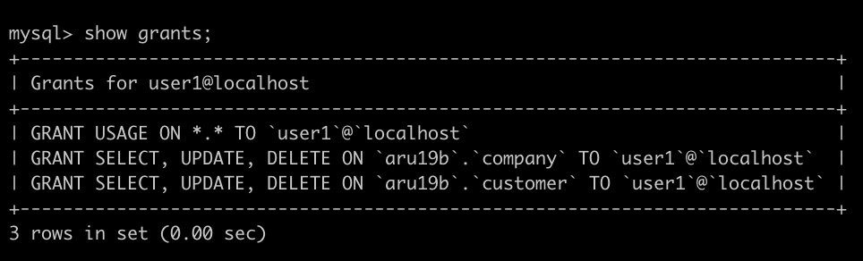
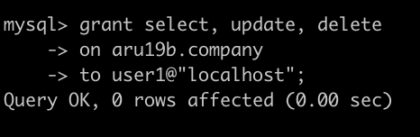
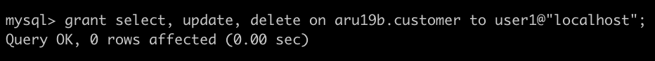
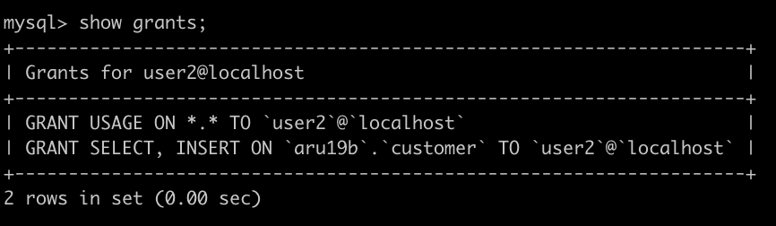
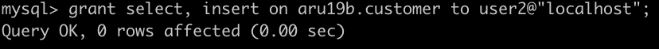

> **NOTE:** This README.md file should be placed at the **root of each of your repos directories.**
>
>Also, this file **must** use Markdown syntax, and provide project documentation as per below--otherwise, points **will** be deducted.
>

# lis3781 Advanced Database Management

## Ashton Uttayaya

### Assignment 2 Requirements:

*Four Parts:*

1. Tables and insert statements
2. Include indexes and foreign key SQL statements
3. Include query result sets
4. Create two users and give them permissions and show their grants

#### README.md file should include the following items:

* Screenshot of A2 code for both tables
* Screenshot of query results from both tables

#### Assignment Screenshots:

#### *Screenshots of SQL code and query results for each table.*:

Company Table              |  Customer Table
:-------------------------:|:-------------------------:
  |  

Company Query              |  Customer Query
:-------------------------:|:-------------------------:
  |  

User1 Grants               |  User1 grants on company  | User 1 grants on customer
:-------------------------:|:-------------------------:|:-------------------------:
  |    | 

User 2 Grants              |  User 2 grants on customer
:-------------------------:|:-------------------------:
  |  

