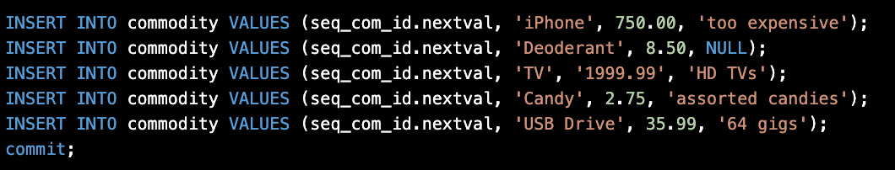

> **NOTE:** This README.md file should be placed at the **root of each of your repos directories.**
>
>Also, this file **must** use Markdown syntax, and provide project documentation as per below--otherwise, points **will** be deducted.
>

# lis3781 Advanced Database Management

## Ashton Uttayaya

### Assignment 3 Requirements:

*Three Parts:*

1. Tables and insert statements
2. Use Oracle SQL syntax to create and populate tables
3. Include query result sets in Oracle SQL Developer

#### README.md file should include the following items:

* Screenshot of SQL code use to create and populate tables tables
* Screenshot of query results from all tables

#### Assignment Screenshots:

#### *Screenshots of SQL code and query results for each table.*:

Customer Table             |  Customer Population
:-------------------------:|:-------------------------:
  |  

Commodity Table            |  Commodity Population
:-------------------------:|:-------------------------:
  |  

Order Table                |  Order Population
:-------------------------:|:-------------------------:
  |  

Result Query 			   |
:-------------------------:|
 |

