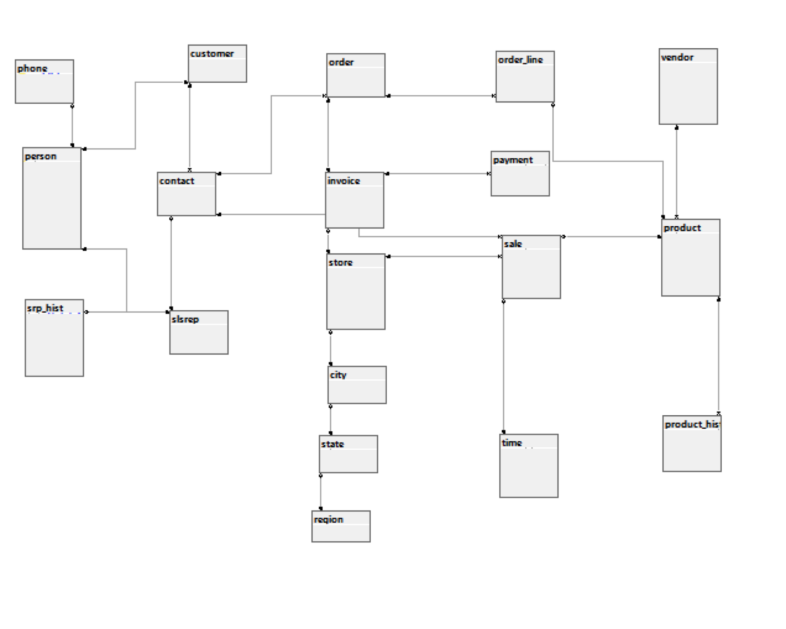
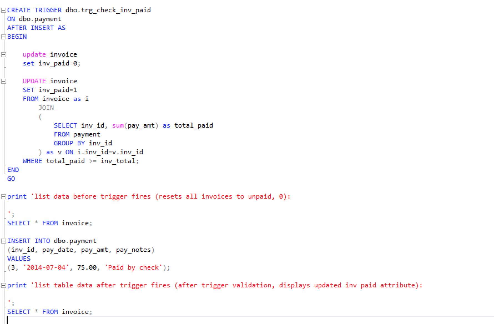

> **NOTE:** This README.md file should be placed at the **root of each of your repos directories.**
>
>Also, this file **must** use Markdown syntax, and provide project documentation as per below--otherwise, points **will** be deducted.
>

# lis3781 Advanced Database Management

## Ashton Uttayaya

### Assignment 5 Requirements:

*Three Parts:*

1. Create database for business including sales reps, clients, vendors, orders, and stores.
2. Salt and hash sensitive information like SSN's
3. Create an ERD in SQL Server

### Business Rules
A high-volume home office supply company contracts a database designer to develop a system in order to 
track its day-to-day business operations. The CFO needs an updated method for storing data, running 
reports, and making business decisions based upon trends and forecasts, as well as maintaining historical 
data due to new governmental regulations. Here are the mandatory business rules:  

* A sales representative has at least one customer, and each customer has at least one sales rep on any given day (as it is a high-volume organization). 

* A customer places at least one order. However, each order is placed by only one customer. 

* Each order contains at least one order line. Conversely, each order line is contained in exactly one order. 

* Each product may be on a number of order lines. Though, each order line contains exactly one product id (though, each product id may have a quantity of more than one included, e.g., “oln_qty”). 

* Each order is billed on one invoice, and each invoice is a bill for exactly one order (by only one customer). 

* An invoice can have one (full), or can have many payments (partial). Though, each payment is made to only one invoice. 

* A store has many invoices, but each invoice is associated with only one store. 

* A vendor provides many products, but each product is provided by only one vendor. 

* Must track yearly history of sales reps, including (also, see Entity-specific attributes below): yearly sales goal, yearly total sales, yearly total commission (in dollars and cents). 

* Must track history of products, including: cost, price, and discount percentage (if any). 

### Notes:
* A customer’s contact (in-store or online) is made through a sales rep. 

* A customer buys or potentially buys products from the company, but does not have to. 

* An order is a purchase of one or more products by a customer. If an order is cancelled, it is deleted (optional participation). 

* An order line contains the details about each product sold on a particular customer order, and includes data such as quantity and price. 

* A product is an item that the company sells that was initially bought from an outside vendor (which may also be the manufacturer). 

* A sales rep receives a 3% commission based upon the amount of year-to-date sales. 

* A sales reps’s current yearly sales goal is 8% more than their previous year’s total sales. 

### Additional Notes:
* Social security numbers, should be unique, and hashed and salted for security purposes. 

* ERD MUST include relationships, though, not cardinalities. 

* Appropriate attributes *are* required (e.g., name, ssn (for sales rep and customer), dob, address, phone, email, url... also, see Assignment Guidelines, and Notes above),
 
* Entity-specific attributes (apart from attributes required in Assignment Guidelines): 

* Sales rep: ssn, current year sales goal (stored derived attribute, 8% of previous year’s total sales), year-to-date sales, year-to-date commission (stored derived attribute, 3% of year-to-date sales). 

* Customer: ssn, balance and total sales 

* Order: placed and filled dates 

* Order line: quantity and price 

* Product: name, description, weight, quantity-on-hand, cost, price, discount (as percentage) 

* Invoice: store id, date, total, paid (bit value), ord_id must contain a unique index to create a one-to-one relationship with order! 

* Payment: date, amount 

* Sales rep history: action (insert, update, delete), modified (timestamp), modifier (user making modification), date (only year), yrly sales goal, yrly total sales, yrly total comm. 

* Product history: date (datetime), cost, price, discount (as percentage).

#### README.md file should include the following items:

* Screenshot of ERD

#### Assignment Screenshots:

#### *Screenshot of ERD from SQL Server:*

 

#### *Screenshot of reports from SQL Server:*
 
 

