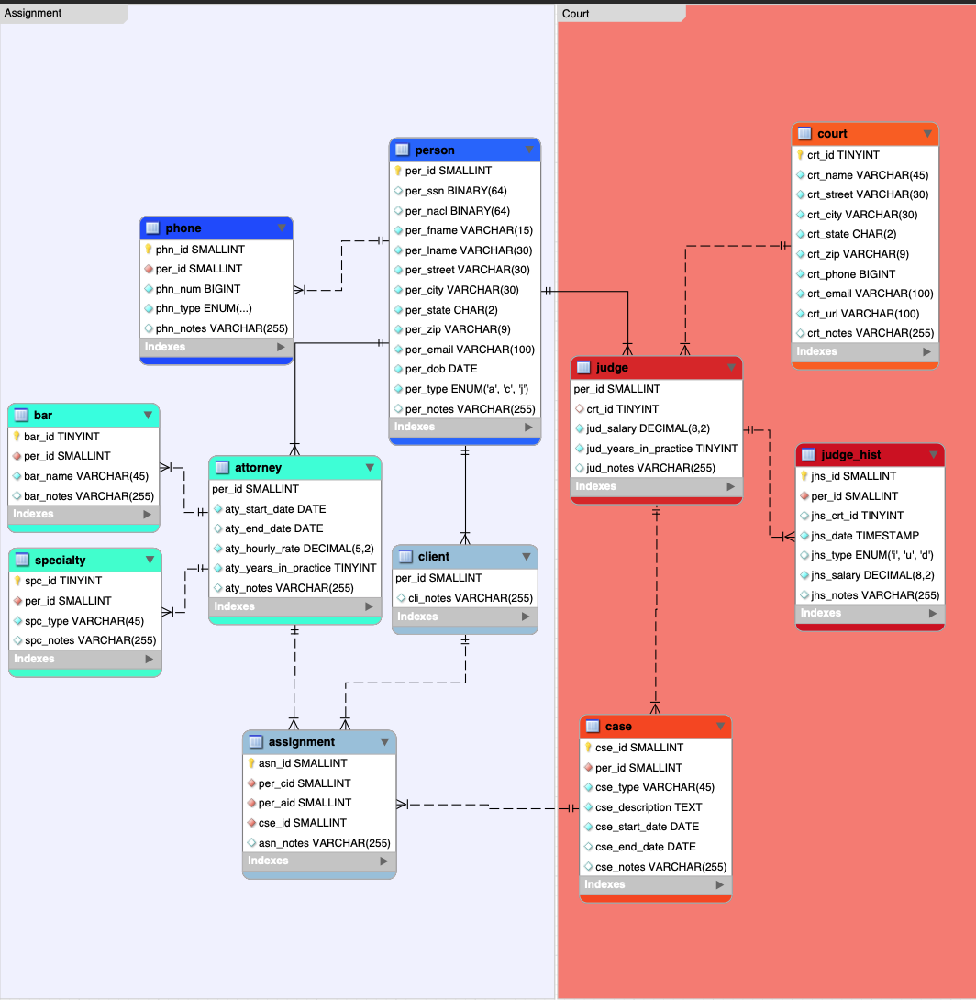
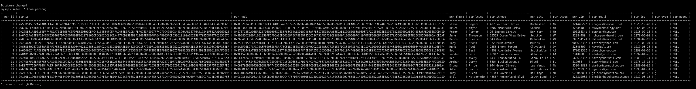

> **NOTE:** This README.md file should be placed at the **root of each of your repos directories.**
>
>Also, this file **must** use Markdown syntax, and provide project documentation as per below--otherwise, points **will** be deducted.
>

# lis3781 Advanced Database Management

## Ashton Uttayaya

### Project 1 Requirements:

*Three Parts:*

1. Create database for law firm including judge history, clients, and person being represented including the case files.
2. Salt and hash sensitive information like SSN's
3. Create stores procedures and events within SQL

#### README.md file should include the following items:

* Screenshot of ERD
* Screenshot of person table
* Bitbucket repo link

#### Assignment Screenshots:

#### *Screenshots of SQL code and query results for each table.*:

ERD                        |
:-------------------------:|
 

Person Table               |  
:-------------------------:|
  

