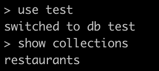
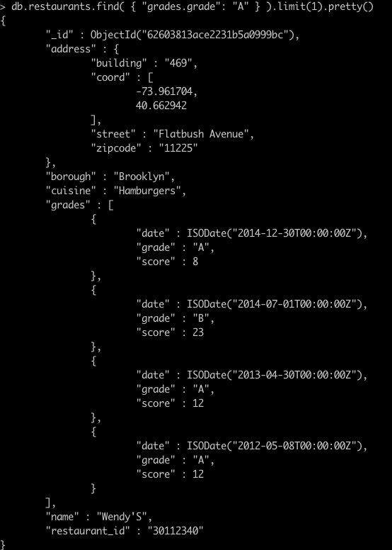

> **NOTE:** This README.md file should be placed at the **root of each of your repos directories.**
>
>Also, this file **must** use Markdown syntax, and provide project documentation as per below--otherwise, points **will** be deducted.
>

# lis3781 Advanced Database Management

## Ashton Uttayaya

### Project 2 Requirements:

*Three Parts:*

1. Use mongoimport to import a json file into mongo
2. Use of mongodb shell commands
3. Required report and JSON solution

#### README.md file should include the following items:

* Screenshot of shell commands
* Screenshot of required report and json solution

#### Assignment Screenshots:

#### *Screenshots of MongoDB shell commands  and JSON reports.*:

#### *Screenshot of mongodb shell command:*
 

#### *Screenshot of JSON report:*

